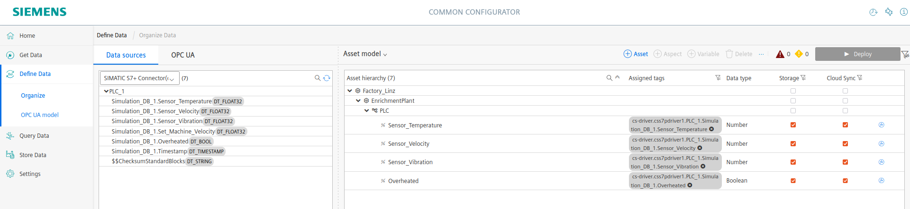

# Interconnectivity Solution with IIH - Bidirectional Communication SQL and S7+

- [Interconnectivity Solution with IIH - Bidirectional Communication SQL and S7+](#interconnectivity-solution-with-iih---bidirectional-communication-sql-and-s7)
  - [General Task](#general-task)
  - [Requirements](#requirements)
    - [Deployment of TIA Project](#deployment-of-tia-project)
    - [Deployment of a MSSQL Database](#deployment-of-a-mssql-database)
    - [Industrial Edge Device](#industrial-edge-device)
    - [IIH Setup](#iih-setup)
    - [Flow-Creator](#flow-creator)
    - [OPC UA Server](#opc-ua-server)
    - [Insight Hub Connection](#insight-hub-connection)
  - [Simulation of MachineData](#simulation-of-machinedata)
  - [Usage: OPC UA Client](#usage-opc-ua-client)
  - [Limitations and Good2Knows](#limitations-and-good2knows)
  - [Documentation](#documentation)
  - [Contribution](#contribution)
  - [License and Legal Information](#license-and-legal-information)

## General Task

This document provides an overview of the data integration process utilizing various connectors and protocols within the industrial automation environment. The integration involves extracting data from a Programmable Logic Controller (PLC) using the S7+ Connector via the Industrial Information Hub (IIH), transferring selected data to a SQL database bidirectionally through the Axtesys SQL Connector, exchanging other data bidirectionally with a Manufacturing Execution System (MES) via OPC UA Server, and transmitting data to Insights Hub (IH) via MQTT protocol.

- Extract data from a PLC using the S7+ Connector via the Industrial Information Hub (IIH).
- Transfer selected data bidirectionally to a SQL database using the Axtesys SQL Connector and retrieve data from it.
- Exchange other data bidirectionally via an OPC UA Server.
- Send data to Insights Hub (IH) using MQTT protocol.


## Requirements

The setup consists of following major components.

- PLC (e.g. PLC with S7-PLCSim Advanced)
- Industrial Edge Device (e.g. vIED)
- MS SQL Database (e.g. [mssql-server](https://learn.microsoft.com/en-us/sql/linux/quickstart-install-connect-ubuntu?view=sql-server-ver16&tabs=ubuntu2004))
- OPC UA Client (e.g. [opcua-commander](https://github.com/node-opcua/opcua-commander))
- Insight Hub
- (optional) SQL-Client (e.g. DBeaver)

All components need to be connected through a TCP/IP network.
The data is produced via a simple machine simulation.
Details about the simulation will be discussed
in chapter [Simulation of MachineData](#simulation-of-machinedata).

### Deployment of TIA Project

Import the project, [here](src/TIA_Portal/SQLKonnektorUseCase.zap19), with a TIA Portal v19 and deploy the project to an appropriate destination (e.g. S7-PLCSim Advanced).

### Deployment of a MSSQL Database

Feel free to use a MSSQL Database of your choice. My recommendation is to use the official mssql-server from Microsoft. The tutorial can be found [here](https://learn.microsoft.com/en-us/sql/linux/quickstart-install-connect-ubuntu?view=sql-server-ver16&tabs=ubuntu2004).

With a running MSSQL Database, create a database that suits the simulation data. In the end the data of the S7+ Connector should be connected to the MSSQL Database, therefore it needs to have the same data structure. For this setup I recommend using DBeaver as a SQL client, as it is free and simple to use. But feel free to use any other SQL Client to connect to the previous created MSSQL Database.

Following SQL-Commands should be used for the table creation.

```sql
CREATE TABLE MachineData (
    Sensor_Temperature int,
    Sensor_Velocity int,
    Sensor_Vibration int,
    Set_Machine_Velocity int,
    Overheated bit,
    Timestamp datetime
);

```

### Industrial Edge Device

- Onboarded IED
  - Installed applications:
    - Common Configurator (tested with v1.10.0)
    - IIH Essentials (tested with v1.10.2)
    - IIH Semantics (tested with v1.10.0)
    - Registry Service (tested with v1.10.0)
    - S7+ Connector (tested with v1.3.0)
    - Axtesys MSSQL Connector [not free] (tested with v1.1.1)
    - Databus (tested with v2.3.3)
      - with deployed user
    - Flow Creator (tested with v1.17.1)

### IIH Setup

First add the databus-user to the Subscriber/Publisher Databus Credentials inside the IIH-Settings.

Open the IIH application and click on the **Get Data**. You should see two available connectors (Simatic S7+ Connector and Axtesys MSSQL Connector). Click on the S7+ Connector and add a data source via the [Simatic Scade export file](src/TIA_Portal/Export.zip). The export file can also be extracted manually by using the **SIMATIC SCADA Export Tool** on the given TIA Portal project.

Click the **Publish on the databus** checkbox for all datapoints and set the Acquisition Cycle to 1 second. The final setup should look like following picture. At the end deploy the project.


Next create a data source for the Axtesys MSSQL Connector. First click on create data-srouce and add the parameters appropriate to your setup.
In following image, the user specific inputs are marked with a red box. Make sure that the **Buffer-Box** is unchecked. This guarantees that data is immidiatelly written to the database without waiting to fill a buffer.


After the added datasource, add the appropriate tags, that mirror the previous created database. Apply all existing settings, as in the following reference image.


Additions:
To ease up the work, use following backup-data files for the restore functionalities inside the Connector-Applications. The sensible data was removed and needs to be adjusted appropriate to the existing setup.

- S7+Connector-BackupData: [css7pdriver1_export](src/Industrial_Information_Hub/css7pdriver1_export.json)
- Axtesys-MSSQL-BackupData: [sqlc1_export](src/Industrial_Information_Hub/sqlc1_export.json)

### Flow-Creator

The Flow-Creator Application is created to display MSSQL Data from the IIH Connectivity Suite and to dynamically connect variables from both connectivity applications, so that the data is being read from the S7+ Connector and being written with the Axtesys SQL Connector to the MSSQL Database.

To ease up the work and enable a dynamic association of connected variables, a interconnectivity suite was created. Please import following flow [here](src/Node_Red/dynamic_connectivity_solution.json).

Open the Node-Red settings and navigate to the section dashboards. There you can open the UI of the flow. You will see a Settings Menu, like in the picture below. The very left element displays all available
variables that can be used with the interconnectivity suite. In the middle two dropdown menus can be used to select desired connections and after clicking **Connect Selected**, an entry is created on the very right that will be used for the data transfer. Data will be always transmitted from connection point A (e.g. **ID:1**) to connection point B (e.g. **ID: DP1**).

On the very right the data transfer can be stopped or started. Also all entries can be resetted.


As you might see, there is also a Dashboard implemented that displays exactly the data from the simulation. This dashboard is specific to this use-case. It shows the sensory data and the latest SQL entry.

### OPC UA Server

Change to the **Define Data** tab and import the following OPC UA model, [here](src/Industrial_Information_Hub/MachineDataComplete.xml).

Then connect the S7+ variables with the model. Ignore the Timestamp variable. Use following reference to accomplish this.


After deployment, an OPC UA Client of your choice can establish a connection to the IIH.

### Insight Hub Connection

For connection to the the Insight Hub, an Asset Model is needed. Use this reference image to accomplish this and connect the S7+ Datapoints accordingly. The backup file for this setup can be downloaded [here](src/Industrial_Information_Hub/backup_asset_model.zip).



When the checkbox for the Cloud Sync is checked (Storage must be checked too, to enable it), then only what is left, is an active data connection to the Insight Hub. Please Change to the **Home** tab and click on **+Add**. Use the necessary information to enable a connection to your Insight Hub tenant. For further information and how-tos, please take a look into the official documentation of the IIH-Product.


To ease up the use-case, use the Monitor-Application inside your IH tenant and display all available datapoints in one diagram. This should be sufficient to display the successful data transfer.


## Simulation of MachineData

The complete TIA portal project can be found [here](src/TIA_Portal/SQLKonnektorUseCase.zap19) and the isolated code for the simulation can be found [here](src/TIA_Portal/code.scl).

This simulation replicates the behavior of a motor equipped with sensors for temperature and vibration monitoring. The motor can be set to a specific velocity, and actions are triggered based on sensor readings. Specifically, if the temperature exceeds a certain threshold (120°C), the motor is automatically shut down until it cools down to a safe operating temperature (20°C).

Following variables can be read:

- Set_Machine_Velocity (real | Read/Write)
- Sensor_Temperature (real | Read)
- Sensor_Vibration (real | Read)
- Overheated (boolean | Read)
- Timestamp (DTL | Read)

## Usage: OPC UA Client

After the successful setup of all previous steps, an endpoint should be available that can be used to access the data from the S7+ Connector.
Use a OPC UA Client of your choice and establish a connection to the IIH endpoint.
Use the variable **Set_Machine_Velocity** to increase/decrease the velocity of the machine simulation. Try setting up a velocity of **1000**, so the machine exceeds the critical temperature level and shuts down automatically. This produces well presentable data.

## Limitations and Good2Knows

- Flow-Creator
  - Transfer can only be enabled from S7+ to MSSQL
  - Old values are temporarily stored, so that partial reads from S7+ are still written as a whole row in the MSSQL table
    - Data might be not reliable. If necessary, this feature can be removed.
    - Dashboard was tested with 20 active variables. More variables might exceed the display limits and need further UI adjustments.
  - The connectivity suite can be reused for other use-cases but need adjustements for the data retrieval from the databus and also for the data transmission, as the protocols vary.

## Documentation

You can find further documentation and help in the following links

* [Industrial Edge Hub](https://iehub.eu1.edge.siemens.cloud/#/documentation)
* [Industrial Edge Forum](https://forum.industrial-edge.siemens.cloud)
* [Industrial Edge Documentation](https://docs.industrial-edge.siemens.cloud/)
* [Industrial Edge landing page](https://new.siemens.com/global/en/products/automation/topic-areas/industrial-edge/simatic-edge.html)
* [Industrial Edge GitHub page](https://github.com/industrial-edge)

## Contribution

Thank you for your interest in contributing. Anybody is free to report bugs, unclear documentation, and other problems regarding this repository in the Issues section.
Additionally everybody is free to propose any changes to this repository using Pull Requests.

If you haven't previously signed the [Siemens Contributor License Agreement](https://cla-assistant.io/industrial-edge/) (CLA), the system will automatically prompt you to do so when you submit your Pull Request. This can be conveniently done through the CLA Assistant's online platform.
Once the CLA is signed, your Pull Request will automatically be cleared and made ready for merging if all other test stages succeed.

## License and Legal Information

Please read the [Legal information](LICENSE.md).
